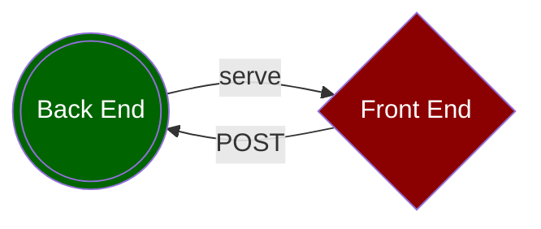

### 1 Back End
- A **Node.js** back end serves
  - **Angular** app (<mark>/client/</mark>)
  - **POST API** (<mark>/server/src/routes/upload.route.mts</mark>)
- **POST API**
  - parses request payload (req.files) via <mark>express-fileupload</mark> middleware
  - saves files to hard drive via <mark>fs</mark> (file system package)

### 2 Front End
- **drag-and-drop directive** (<mark>/client/src/app/modules/shared/drag-and-drop.directive.ts</mark>) allows host to wiggle on dragover
   - wiggle stops on dragleave
   - wiggle stops on filedrop
   - <mark>fileDropped</mark> event is triggered on filedrop, and a FileList object is emitted
- **file-upload component** (<mark>/client/src/app/modules/shared/file-upload/</mark>)
  - accepts an POST URL as input, allowing this component to be consumed by parent components
  - consumes drag-and-drop directive so it wiggles and emits FileList
  - allows a user to either drag-and-drop files, or click a button to select files
  - files are attached to a FormData object as name-value pairs
  - invokes an HTTP POST call to upload files with reportProgress enabled
  - a mat-progress-bar is used to display upload progress
- **upload component** (<mark>/client/src/app/modules/upload/</mark>)
  - consumes file-upload component
  - renders this documentation from a markdown file (<mark>/client/src/assets/markdown/file_upload/file_upload.md</mark>)

