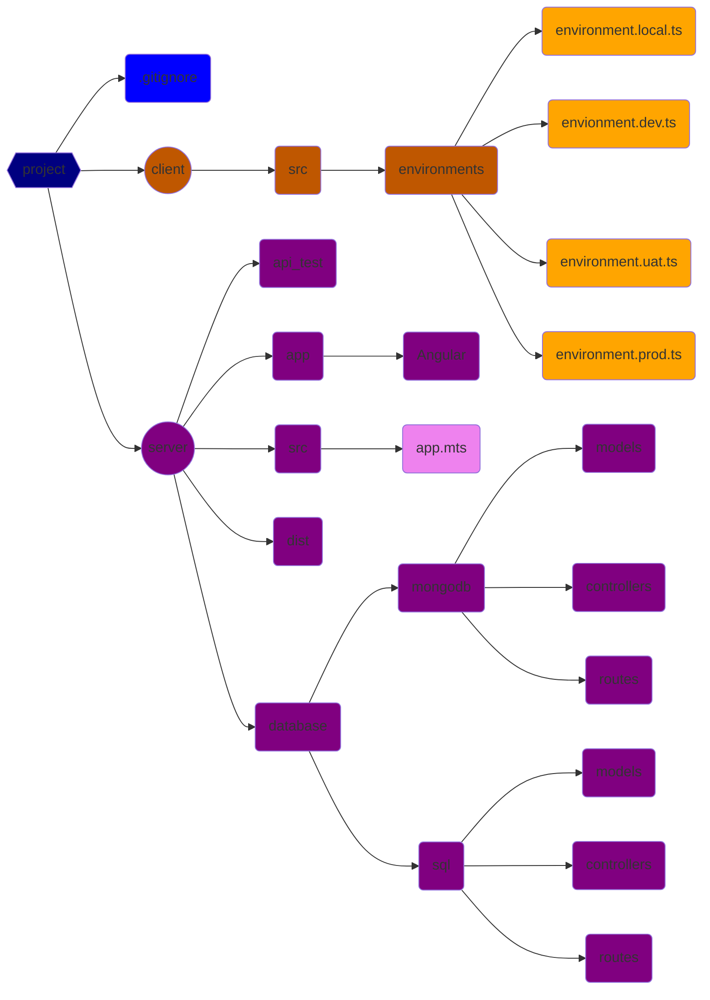

# Node.js back end with TypeScript





```
project
	|
	|
	|--client
	|     |
	|     |--environments
	|             |
	|             |
	|             |--local (developement work in Linux VM using Angular cli in memory server + node.js back end, with cors enabled)
	|             |
	|             |
	|             |--dev (for test in Azure)
	|             |
	|             |
	|             |--uat (user acceptance test)
	|             |
	|             |
	|             |--prod (production)
	|
	|
	|--server
	|     |
	|     |
	|     |--api_test (.http files)
	|     |
	|     |
	|     |--src (TypeScript source code)
	|     |     |
	|     |     |
	|     |     |--app.mts (entry point)
	|     |
	|     |
	|     |--dist (transpiled JavaScript)
	|     |
	|     |
	|     |--database  
	|     |     |
	|     |     |
	|     |     |--mongodb
	|     |     |   |
	|     |     |   |
	|     |     |   |--models (schema and model definition)
	|     |     |   |
	|     |     |   |
	|     |     |   |--controllers (callback functions)
	|     |     |   |
	|     |     |   |
	|     |     |   |--routes
	|     |     |
	|     |     |
	|     |     |--sql
	|     |         |
	|     |         |
	|     |         |--models (model definition)
	|     |         |
	|     |         |
	|     |         |--controllers (callback functions)
	|     |         |
	|     |         |
	|     |         |--routes
	|     |
	|     |
	|     |--app
	|        |
	|        |
	|        |--angular (compiled Angular project. ng build --output-path='../server/app/Angular' -c=uat)
	|
	|
	|--.gitignore

```
